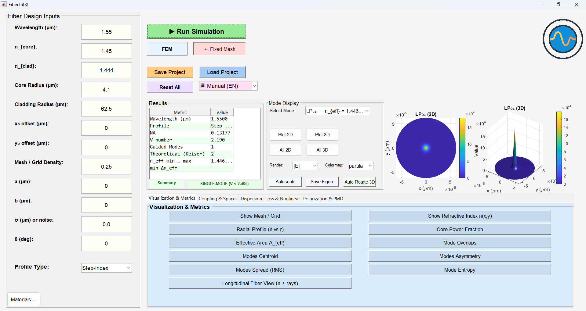
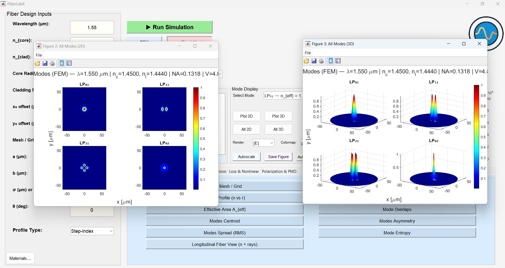
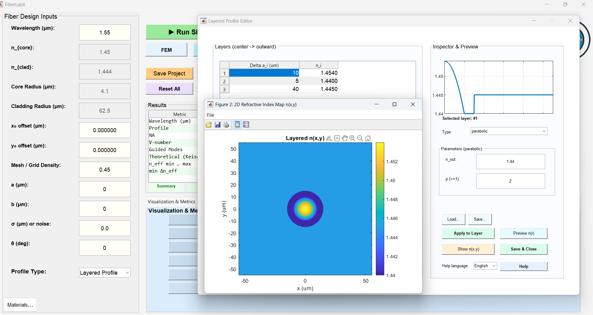
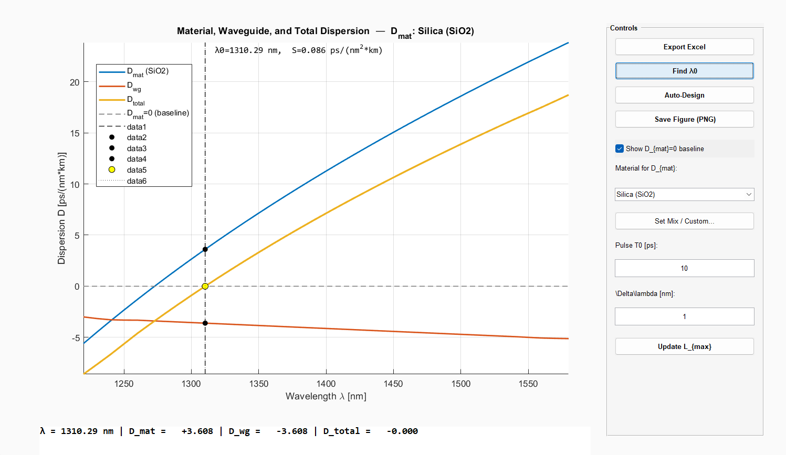
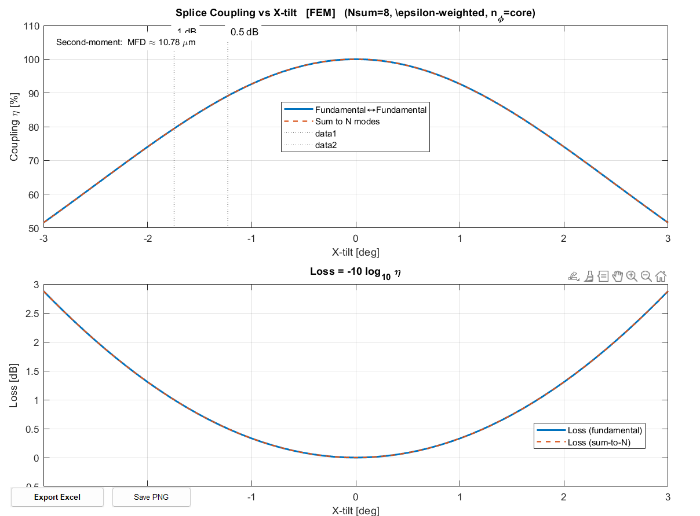
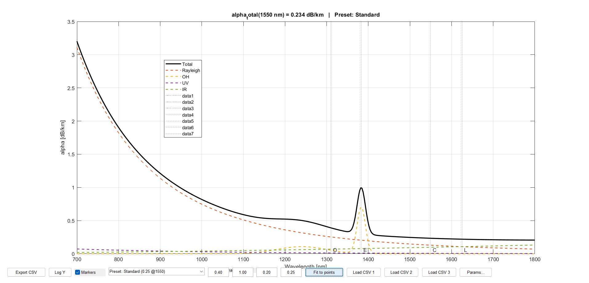

# FiberLabX

## Optical Fiber Mode Analysis Platform

FiberLabX is a MATLAB-based simulation platform for advanced optical fiber analysis using both Finite Element Method (FEM) and Finite Difference Method (FDM).  
It provides a unified environment for mode solving, dispersion engineering, coupling analysis, and custom refractive index design.

---

## 🔬 Research Capabilities

FiberLabX enables:

- Accurate LP mode computation (FEM/FDM)
- Chromatic dispersion and zero-dispersion wavelength (ZDW) analysis
- Effective area (A_eff) and mode field diameter (MFD)
- Mode coupling, birefringence, and splicing analysis
- Custom and layered refractive index profiles
- Loss modeling (bending, spectral, and total loss)

Due to the extensive capabilities of FiberLabX, only a representative subset of results is shown below.

---

## 🖥️ Main Interface

---

## 🌈 Mode Analysis (FEM Solver)

---

## 🧱 Layered Refractive Index Design

---

## 📡 Chromatic Dispersion & ZDW

---

## 🔗 Coupling & Splicing Analysis

---

## 📉 Loss Spectrum

---

## ⚙️ Features

- Mode analysis (LP modes)
- FEM & FDM solvers
- Chromatic dispersion and β₂
- Effective area (A_eff) and MFD
- Mode coupling & birefringence
- Custom refractive index profiles
- Loss and nonlinear analysis tools

---

## 📥 Download

The full software is available via Zenodo:

👉 https://doi.org/10.5281/zenodo.19410920

---

## 📚 Citation

If you use this software in your research, please cite:

Eidan A. Abdullah (2026).  
**FiberLabX: Optical Fiber Simulation Platform**  
Zenodo. https://doi.org/10.5281/zenodo.19410920

---

## 👤 Author

**Eidan A. Abdullah**  
University of Wasit – College of Science  
📧 eidan@uowasit.edu.iq

---

⭐ If you find this project useful, please consider giving it a star!

Eidan A. Abdullah
University of Wasit, Iraq

### 🔹 License

CC BY 4.0
